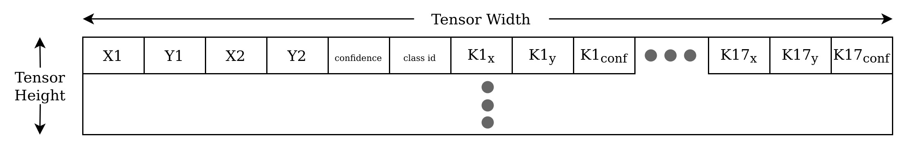
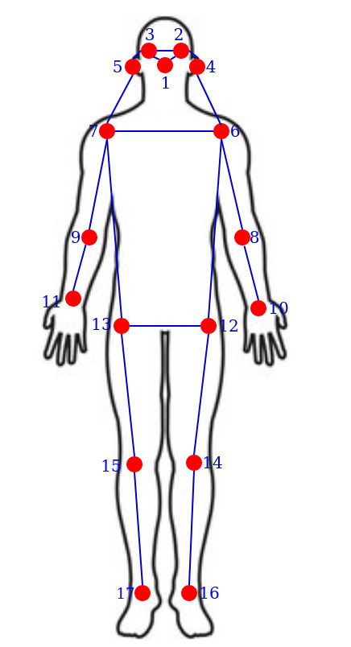
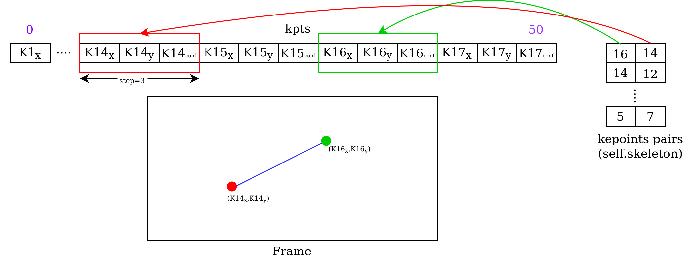

# Edge AI GStreamer Apps for Human Pose Estimation

> Repository to host GStreamer based Edge AI applications for TI devices

This repo adds support for human pose estimation on top of edgeai-gst-apps

## Table of content
- [Supported Devices](#supported-devices)
- [SDK Version](#sdk-version)
- [Steps to run](#steps-to-run)
- [Result](#result)
- [About Human Pose Estimation](#about-human-pose-estimation)
- [Model Directory](#model-directory)
- [How to add your own custom post-processing?](#how-to-add-your-own-custom-post-processing)

## Supported Devices

| **DEVICE**              | **Supported**      |
| :---:                   | :---:              |
| AM62A                   | :heavy_check_mark: |
| AM68A                   | :heavy_check_mark: |
| SK-TDA4VM               | :heavy_check_mark: |
| AM69A                   | :heavy_check_mark: |

## SDK Version

This demo is supported on **EdgeAI SDK Version 9.0**

## Steps to run:

1. Clone this repo in your target under /opt

    ```console
    root@soc:/opt# git clone https://github.com/TexasInstruments/edgeai-gst-apps-human-pose.git
    root@soc:/opt# cd edgeai-gst-apps-human-pose
    ```

2. Download and untar model for human pose estimation

    ```console
    root@soc:/opt/edgeai-gst-apps-human-pose# wget --proxy off https://software-dl.ti.com/jacinto7/esd/edgeai-marketplace/human-pose-estimation/09_00_00/ONR-KD-7060-human-pose-yolox-s-640x640.tar.gz
    root@soc:/opt/edgeai-gst-apps-human-pose# tar -xf ONR-KD-7060-human-pose-yolox-s-640x640.tar.gz -C /opt/model_zoo/
    ```

3. Download sample input video

    ```console
    root@soc:/opt/edgeai-gst-apps-human-pose#  wget --proxy off https://software-dl.ti.com/jacinto7/esd/edgeai-marketplace/human-pose-estimation/09_00_00/human_pose_estimation_sample.h264 -O /opt/edgeai-test-data/videos/human_pose_estimation_sample.h264
    ```

4. Run the python app

    ```console
    root@soc:/opt/edgeai-gst-apps-human-pose# cd apps_python
    root@soc:/opt/edgeai-gst-apps-human-pose/apps_python# ./app_edgeai.py ../configs/human_pose_estimation.yaml
    ```

5. Compile cpp apps

    ```console
    root@soc:/opt/edgeai-gst-apps-human-pose# ./scripts/compile_cpp_apps.sh
    ```

6. Run CPP app

    ```console
    root@soc:/opt/edgeai-gst-apps-human-pose# cd apps_cpp
    root@soc:/opt/edgeai-gst-apps-human-pose/apps_cpp# ./bin/Release/app_edgeai ../configs/human_pose_estimation.yaml
    ```
## Result
<br/>
<p align="center">

</p> 

## About Human Pose Estimation
Multi person 2D human pose estimation is the task of understanding humans in an image. Given an input image, target is to detect each person and localize their body joints. Multi person 2D pose estimation is the task of understanding humans in an image. Given an input image, target is to detect each person and localize their body joints. 

## YOLO-Pose Based Multi-Person Pose Estimation Models
* YOLO-pose is a heatmap-free approach for joint detection, and 2D multi-person pose  estimation in an image based on the popular YOLO object detection framework. This approach doesn’t require the postprocessing of bottom-up approaches to group detected keypoints into a skeleton as each bounding box has an associated pose, resulting in an inherent grouping of the keypoints. For further details refer to this [paper](https://openaccess.thecvf.com/content/CVPR2022W/ECV/papers/Maji_YOLO-Pose_Enhancing_YOLO_for_Multi_Person_Pose_Estimation_Using_Object_CVPRW_2022_paper.pdf).

* YOLO-Pose based models are supported as part of TI Deep Learning Library(TIDL) with full hardware acceleration. These models can be trained and exported following the instruction in this [repository](https://github.com/TexasInstruments/edgeai-yolov5/tree/yolo-pose). 

* The exported models can be further compiled in edgeai-benchmark [repository](https://github.com/TexasInstruments/edgeai-benchmark) with the corresponding [configs](https://github.com/TexasInstruments/edgeai-benchmark/blob/master/configs/human_pose_estimation.py)

## Model Directory

The default model downloaded from the model-zoo will be present under /opt/model_zoo in the target. It is a directory containing the model, artifacts and other necessary information including dataset.yaml file which contains the dataset information of the model and params.yaml file which contains information like the task-type of the model, preprocess information, postprocess information etc.

```
/opt/model_zoo/ONR-KD-7060-human-pose-yolox-s-640x640
└───params.yaml
└───artifacts
    └───allowedNode.txt
    └───detections_tidl_io_1.bin
    └───detections_tidl_net.bin
└───model
    └───yolox_s_pose_ti_lite_49p5_78p0.onnx
```
## How to add your own custom post-processing?

The parent repo of this fork i.e. edgeai-gst-apps supports post-processing for image classification, object detection and semantic segmentation. Since we are adding a new type of task, we need to write out own post-processing logic for it. The application has both python and C++ variants so the same post-processing logic needs to be added to both. It is recommended to start with python and then eventually move to C++. OpenCV, a popular computer vision library is used to draw appropriate detections on the frames.

Post-processing can be simple(ex: image classification) but in some cases the output from the model cannot be directly translated to a visual format. Some complex processing might be needed to convert the output from the deep learing network to a format that can be visualized. A detailed explanation about the post processing code can be found below.

The code changes done to add post-processing logic for human-pose-estimation can be found in this [commit](https://github.com/TexasInstruments/edgeai-gst-apps/commit/284cbedfc3c949a51d71ad6a937cfbfe389ad145).

### <ins>Basic summary of the code changes</ins>
* **apps_python**: Adding new post process class for human pose estimation in post_process.py
* **apps_cpp**:    Make a new post process class for human pose estimation and modify post_process_image.cpp to call the newly created class appropriately
* **configs**:     Create a new config file with the downloaded/custom model

### <ins>Detailed explanation</ins>

#### Interpretation of Model Output
* The default ONNX model downloaded above takes an RGB image of 640x640 as input and predicts a 57 dimensional tensor for each detected class.
* First 6 elements are the box parameters: $\bf \{x_{min}, y_{min}, x_{max}, y_{max}, box_{conf}, class_{id}\}$
* Remaining 51 elements are associated with the keypoints of the object:
    * A set of 17 keypoints are detected and each keypoint has 3 outputs  $\bf \{k1_{x},k1_{y},k1_{conf},...,k17_{x},k17_{y},k17_{conf}\}$. x,y are the co-ordinated of the keypoint, conf is the confidence score of the particular keypoint.

<p align="center">

</p>

#### Skeletal Visualization of the Output Pose
* The inferred pose is commonly visualized by drawing keypoints and linking them using simple line to make a skeletal structure of the pose.
* Each keypoint corresponds to a particular point on the body.
* Pairs of unique keypoints are linked together via a line to obtain skeleton. For example: Drawing line from keypoint on the foot to keypoint on the knee.

<p align="center">

</p>

#### Post-Processing Code

A detailed explanation of python code for post-processing is given below. The same logic applies for C++ as well.

##### <ins>Initialization</ins>

The \_\_init\_\_ function of the class initializes some constant data like color palette and the keypoint connection map.

* **skeleton**

This array is basically a connection map that includes information about what pair of keypoints should be connected to sketch out a skeleton structure.
For example: 16th Keypoint should be linked to 14th keypoint via a line and so on.

```python
self.skeleton = [
            [16, 14],
            [14, 12],
            [17, 15],
               .
               .
               .
        ]
```


* **color-palette**

This is basically a unique RGB color-map for each of the keypoint as well as the color for the line connecting those keypoints to form a skeletal structure.
The color-map for 2D bounding box around particular class-id is also defined.

```python

 # This list is used to identify the color of the keypoint
self.palette = np.array(
    [
        [255, 128, 0],
        [255, 153, 51],
        [255, 178, 102],
        [230, 230, 0],
                .
                .
                .
    ]
)

# Choosing color of all the links b/w keypoints
self.pose_limb_color = self.palette[
    [9, 9, 9, 9, 7, 7, 7, 0, 0, 0, 0, 0, 16, 16, 16, 16, 16, 16, 16]
]

# Choosing color for all 17 keypoint
self.pose_kpt_color = self.palette[
    [16, 16, 16, 16, 16, 0, 0, 0, 0, 0, 0, 9, 9, 9, 9, 9, 9]
]
```
##### <ins>Post-process logic</ins>

The underlying dl-inference engine that edgeai-gst-apps uses is cabable of batch processing hence it gives out a list results. Since we are processing one frame at a time, each batch contains single frame. This ensures that the first member of the results list is the actual result. The obtained result is a tensor of fixed height and width, where width corresponds to the outputs for each detection and height corresponds to the number of detections in a single frame. Here is the visualization of the output from default Human pose estimation model downloaded above. The output from this model is contiguous in memory.

<p align="center">

</p>

```python
def __call__(self, img, result):
        output = np.squeeze(result[0])

        '''
        No of rows represents no of persons in that frame, first 4 columns gives the co-ordinates of rectangle
        4 : score, 5 : label, from 6 to end : co-ordinates of 17 keypoints and its confidence score.
        '''
        det_bboxes, det_scores, det_labels, kpts = (
                                                    np.array(output[:, 0:4]),
                                                    np.array(output[:, 4]),
                                                    np.array(output[:, 5]),
                                                    np.array(output[:, 6:]),
                                                   )
```

For each detection, the 2D bounding box, confidence, class id and a set of 17 keypoints is obtained (each keypoint contains 3 data values - x,y,conf).
Opencv function is used to draw a simple 2D bounding box around the detected object and putText is used for rendeing some text.

```python
for idx in range(len(det_bboxes)):
    # 2D bounding box
    det_bbox = det_bboxes[idx]

    # Keypoints
    kpt = kpts[idx]

    '''
    viz_threshold (vizualization threshold) is a used configured parameter.
    if the confidence soce is less than this, detection will be skipped.
    '''
    if det_scores[idx] > self.model.viz_threshold:
        color_map = self._CLASS_COLOR_MAP[int(det_labels[idx])]
        
        '''
        Resizing the co-ordinates.
        The detected output is given with respect to the dimension of input
        frame to the model(640x640). The output frame size we ultimately want to
        vizualise might be different, hence scaling is needed.

        self.model.resize is the input dimension that model expects. 
        img.shape is the dimension of output frame.
        '''
        det_bbox[..., (0, 2)] /= self.model.resize[0]
        det_bbox[..., (1, 3)] /= self.model.resize[1]
        det_bbox[..., (0, 2)] *= img.shape[1]
        det_bbox[..., (1, 3)] *= img.shape[0]
        
        # Drawing rectangle
        img = cv2.rectangle(
            img,
            (det_bbox[0], det_bbox[1]),
            (det_bbox[2], det_bbox[3]),
            color_map[::-1],
            2,
        )
        cv2.putText(
            img,
            "id:{}".format(int(det_labels[idx])),
            (int(det_bbox[0] + 5), int(det_bbox[1]) + 15),
            cv2.FONT_HERSHEY_SIMPLEX,
            0.5,
            color_map[::-1],
            2,
        )
        cv2.putText(
            img,
            "score:{:2.1f}".format(det_scores[idx]),
            (int(det_bbox[0] + 5), int(det_bbox[1]) + 30),
            cv2.FONT_HERSHEY_SIMPLEX,
            0.5,
            color_map[::-1],
            2,
        )
```

Finally, circle can be drawn to depict the keypoints and specific keypoints pairs can be connected via simple line to make a skeletal structure. Keypoint pairs to be connected is dictated by the skeleton array initialized in the init function.

```python
def plot_skeleton_kpts(self, img, kpts, steps=3):
    """
    Draw the skeleton like structure
    by joining the appropriate key points with lines
    Args:
        img: Input frame.
        kpts (numpy array): Contains the co-ordinates and confidence score of a single person.
        steps: by default 3 values are needed to represent each keypoint (x_cord, y_cord, conf).
    """
    
    num_kpts = len(kpts) // steps

    # Drawing circle to indicate a keypoint
    for kid in range(num_kpts):
        r, g, b = self.pose_kpt_color[kid]
        x_coord, y_coord = kpts[steps * kid], kpts[steps * kid + 1]
        # Resizing
        x_coord = x_coord * img.shape[1] / self.model.resize[0]
        y_coord = y_coord * img.shape[0] / self.model.resize[1]
        conf = kpts[steps * kid + 2]
        if conf > 0.5:
            # Drawing circle
            cv2.circle(
                img,
                (int(x_coord), int(y_coord)),
                self.radius + 3,
                (int(r), int(g), int(b)),
                -1,
            )

    # Draw line between keypoint pairs in self.skeleton
    for sk_id, sk in enumerate(self.skeleton):
        r, g, b = self.pose_limb_color[sk_id]
        pos1 = (int(kpts[(sk[0] - 1) * steps]), int(kpts[(sk[0] - 1) * steps + 1]))
        pos1 = (
            int(pos1[0] * img.shape[1] / self.model.resize[0]),
            int(pos1[1] * img.shape[0] / self.model.resize[1]),
        )
        pos2 = (int(kpts[(sk[1] - 1) * steps]), int(kpts[(sk[1] - 1) * steps + 1]))
        pos2 = (
            int(pos2[0] * img.shape[1] / self.model.resize[0]),
            int(pos2[1] * img.shape[0] / self.model.resize[1]),
        )
        conf1 = kpts[(sk[0] - 1) * steps + 2]
        conf2 = kpts[(sk[1] - 1) * steps + 2]
        if conf1 > 0.5 and conf2 > 0.5:
            # Connecting two keypoints with line
            cv2.line(img, pos1, pos2, (int(r), int(g), int(b)), thickness=2)
    return img
```

<p align="center">

</p>